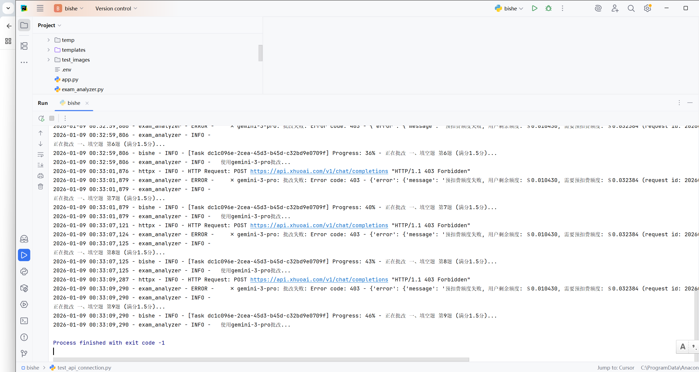
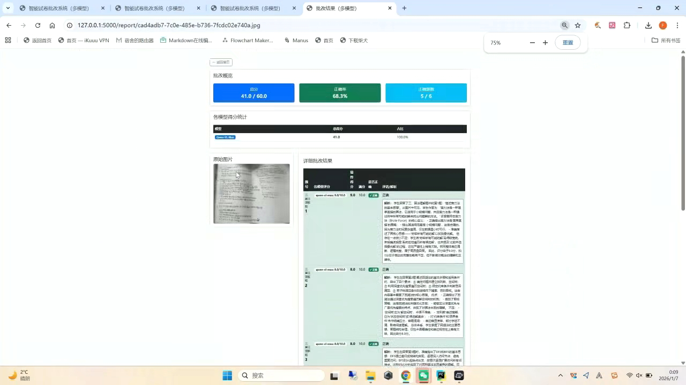
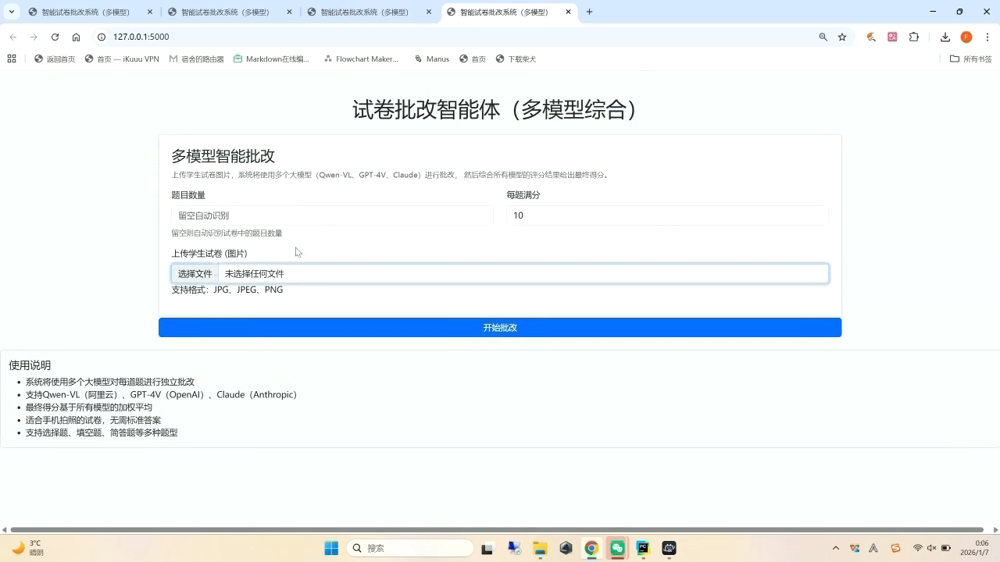

# SmartGrade - 智能试卷批改系统

[](https://www.python.org/)
[](https://flask.palletsprojects.com/)
[](https://creativecommons.org/licenses/by-nc-sa/4.0/)

SmartGrade 是一个基于多模态大模型（VLM）的智能试卷批改系统。它能够自动分析试卷结构，识别题目和手写答案，并结合标准答案（支持 Word 文档）进行多维度评分和点评。

## 核心特性

### 多模型智能批改
- **Qwen-VL-Max** (通义千问) - 阿里云顶级视觉语言模型
- **Gemini 1.5 Pro** (via XHuoAI) - Google最新多模态AI
- **GLM-4V** (智谱AI) - 国产领先视觉大模型
- **多模型协作** - 综合多个模型结果，提高准确性

### 智能试卷分析
- 自动结构识别 - 支持双栏布局试卷
- 题号定位 - 精确定位每道题位置  
- 分值提取 - 自动识别题目分值
- 空白卷检测 - 准确识别未作答题目

### 智能评分系统
- 三维评分 - 正确性(50%) + 逻辑清晰度(30%) + 表达完整性(20%)
- 标准答案比对 - 支持.docx格式标准答案
- 反幻觉机制 - 严格区分打印体(题目)和手写体(答案)
- 涂改识别 - 智能识别学生涂改痕迹

### 可视化报告
- 标记试卷 - 在原图上标注对错
- 详细解析 - 生成专业评语和分析
- 多格式输出 - JSON + HTML + Word报告
- 历史记录 - 完整的批改历史管理

## 效果展示

### 首页上传界面


### 批改结果展示  


### 详细报告页面


## 快速开始

### 环境搭建

推荐使用 Conda 创建独立的虚拟环境。

#### 1. 创建虚拟环境
```bash
# 创建名为 smartgrade 的环境，推荐使用 Python 3.10 或更高版本
conda create -n smartgrade python=3.10

# 激活环境
conda activate smartgrade
```

#### 2. 一键安装依赖
```bash
# 使用清华源加速下载
pip install -r requirements.txt -i https://pypi.tuna.tsinghua.edu.cn/simple
```

> **注意**: 本项目依赖 `paddleocr` 和 `opencv-python-headless` 进行图像处理，如果安装过程中遇到问题，请确保系统已安装相关的 C++ 编译工具。

### 配置API密钥

项目使用环境变量来管理大模型的 API 密钥。

1. 在项目根目录下创建 `.env` 文件：
```bash
cp .env.example .env
```

2. 编辑 `.env` 文件，填入你的API密钥：

```ini
# Flask Secret Key
SECRET_KEY=your_very_strong_secret_key_here

# 阿里云 DashScope API Key (用于 Qwen-VL-Max)
# 获取地址: https://bailian.console.aliyun.com/
DASHSCOPE_API_KEY=sk-xxxxxxxxxxxxxxxxxxxxxxxxxxxxxxxx

# 智谱 AI (GLM-4V) API Key
# 获取地址: https://open.bigmodel.cn/
ZHIPU_API_KEY=xxxxxxxxxxxxxxxxxxxxxxxxxxxxxxxx.xxxxxxxxxxxxxxxx

# XHuoAI API Key (用于 Gemini 3 Pro / 1.5 Pro)
# 获取地址: https://api.xhuoai.com/
XHUOAI_API_KEY=sk-xxxxxxxxxxxxxxxxxxxxxxxxxxxxxxxx
XHUOAI_BASE_URL=https://api.xhuoai.com/v1
```

> **提示**: 你只需要配置你计划使用的模型的 API Key。例如，如果你只打算使用 Qwen-VL，则只需配置 `DASHSCOPE_API_KEY`。

## 项目结构

```
SmartGrade/
├── app/
│   ├── routes/          # 路由定义 (API 接口与页面路由)
│   ├── services/        # 核心业务逻辑
│   │   ├── grading_service.py  # 批改服务 (调用大模型)
│   │   ├── image_service.py    # 图像处理服务 (OpenCV/PaddleOCR)
│   │   └── report_service.py   # 报告生成服务
│   ├── utils/           # 工具函数 (日志、文件处理)
│   └── config.py        # 应用配置
├── static/              # 静态文件 (上传的试卷、生成的报告)
├── templates/           # HTML 模板
├── tests/               # 测试脚本
├── images/              # 项目效果图
├── run.py               # 项目启动入口
├── requirements.txt     # 项目依赖
├── deploy.sh            # Linux一键部署脚本
├── start.sh             # 服务启动脚本
├── stop.sh              # 服务停止脚本
└── .env                 # 环境变量配置文件
```

## 运行指南

确保环境已激活且依赖已安装，在项目根目录下运行：

```bash
python run.py
```

启动成功后，控制台会显示访问地址，通常为：
`http://127.0.0.1:5000`

在浏览器中打开该地址即可使用系统。

## 使用流程

1. **上传试卷**：在首页上传学生试卷图片（支持 JPG, PNG）
2. **上传答案（可选）**：上传对应的标准答案 Word 文档（.docx）
3. **选择模型**：勾选你希望使用的 AI 模型（如 Qwen-VL-Max）
4. **开始批改**：点击"开始批改"，系统将后台运行
5. **查看结果**：批改完成后，查看详细的得分、评语以及标记后的试卷图片

## Linux服务器部署

项目提供完整的Linux部署方案：

```bash
# 1. 赋予脚本执行权限
chmod +x deploy.sh start.sh stop.sh

# 2. 一键部署
./deploy.sh

# 3. 配置环境变量
cp .env.example .env
nano .env

# 4. 启动服务
./start.sh

# 5. 停止服务  
./stop.sh
```

详细部署指南请查看 [DEPLOYMENT_LINUX.md](DEPLOYMENT_LINUX.md)

## 许可证

本项目采用 **CC BY-NC-SA 4.0** 许可证。

### 许可说明

| 权限 | 说明 |
|------|------|
| ✅ 个人学习 | 允许免费用于个人学习和研究 |
| ✅ 非商业使用 | 允许非商业用途的使用和分发 |
| ✅ 修改 | 允许修改和衍生作品 |
| ✅ 注明原作者 | 必须注明原作者并保留版权声明 |
| ❌ 商业使用 | 未经授权禁止商业用途 |

### 商业许可
如需将本项目用于商业用途，请联系作者获取商业许可。

### 完整许可文本
完整的许可证内容请查看 [LICENSE](LICENSE) 文件。

## 贡献指南

欢迎贡献！请查看 [CONTRIBUTING.md](CONTRIBUTING.md) 了解详细的贡献指南。

### 如何贡献
- 报告Bug
- 提出新功能建议  
- 改进文档
- 提交代码修复

## 技术支持

遇到问题？请先查看：
- [常见问题解答](#常见问题)
- [GitHub Issues](https://github.com/1640946640/SmartGrade/issues)

## 常见问题

### Q: 需要多少内存才能运行？
A: 最低4GB RAM，推荐8GB+以获得最佳性能。

### Q: 支持哪些操作系统？
A: Windows、macOS、Linux全平台支持。

### Q: 批改准确率如何？
A: 通过多模型协作，准确率可达90%以上，具体取决于试卷质量和模型选择。

### Q: 是否支持手写体识别？
A: 是的！系统专门针对手写体进行了优化，能准确区分印刷体和手写体。

---

**Star this repository if you find it useful!**  
**Fork and contribute to make it even better!**

*Created for SmartGrade Project.*